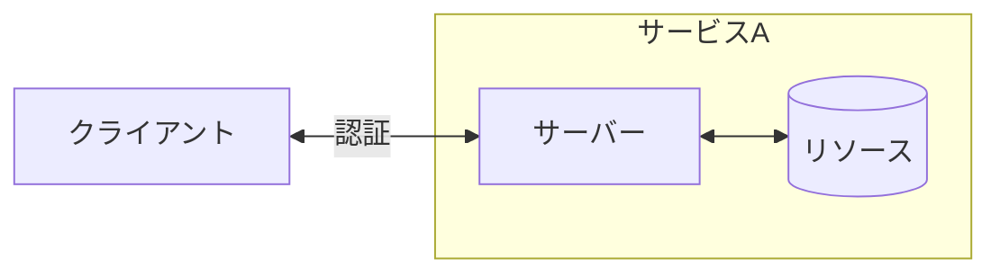
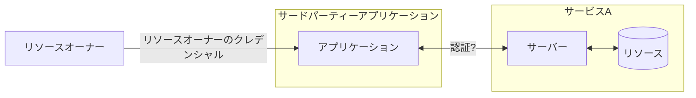

## はじめに

この文章は OAuth 2.0 のコンセプトについて OAuth 2.0 の公式ドキュメントを引用しつつ、自分が分かりにくかった箇所について調べた周辺知識などを紹介し、最終的に OAuth 2.0 公式ドキュメントが読みやすくなることを目的とした文章です。

### （分かる人向け）本稿のスタンス

本稿では OAuth 2.0 のことは RFC6749 のみを指します。
Bearer Token や OpenID Connect なども広義の意味で OAuth 2.0 の仕様の一部と捉えられるかもしれませんが、本稿では扱いません。

### 余談

ちなみに、一時期あやまった理解を記事にしてしまっていた時期があります。

:::details 詳細
修正前の内容は以下でした。
https://github.com/mirko-san/zenn-conect/blob/b7112b0ed899f248e027addfdc2c2399a1a4f651/articles/d5bd27ef651494.md

誤りの詳細、取り下げ理由などの詳細は以下です。
https://github.com/mirko-san/zenn-conect/blob/eac9c61546ba266124a1cb4984079eafb3fc3af4/articles/d5bd27ef651494.md
:::

そしてもう一度公式ドキュメントの読み直しをしてみたところ、「自分でも完全に理解するのは難しいし、さらに知識ゼロの人向けに抽象化するのは難しい概念だなあ」と考えが変わりました。
そのため、タイトルを「知識ゼロからふんわり理解する OAuth 2.0 」から「 OAuth 2.0 のコンセプトを段階ごとに理解する」とし、コンセプトを変更しました。

## OAuth 2.0 のコンセプトを確認

公式のコンセプトは以下です。

> 従来のクライアントサーバー型の認証モデルでは, クライアントはリソースオーナーのクレデンシャルを使ってサーバーに対して認証を行い, サーバー上の保護されたリソースにアクセスする. つまり, サードパーティーアプリケーションに保護されたリソースへのアクセス権を与えるには, リソースオーナーは自身のクレデンシャルをサードパーティーと共有する必要がある. これはいくつかの問題と制限をもたらす.
> (中略)
> OAuth は, 認可レイヤーをもうけてクライアントとリソースオーナーの役割を分けることで, これらの問題の解決に取り組む.
> https://openid-foundation-japan.github.io/rfc6749.ja.html#anchor1

上記の文を理解するためには、以下のことを理解している必要があるかと思います。

- 「認証」とは何か
- 「従来のクライアントサーバー型の認証モデル」とは何か

これらのことについて段階的に私の理解をまとめていきます。

## 「認証」を理解する

「認証」とは何でしょうか？
それを本稿では「本人かどうか確認すること」とします。
昨今「多要素認証」という単語を見聞きする機会もあるかと思いますが、「認証」には以下の 3 つの要素があるとされています。

- 知識情報
- 所持情報
- 生体情報

これはすべて「利用者が本人であるかどうか」を確認する方法です。
そして、この認証をインターネットで提供されているサービスで行うのに使うのが HTTP 認証です。（と表現します）

##### 参考

https://www.nri.com/jp/knowledge/glossary/lst/ta/multi_factor_authentication

### 「認証方式」を理解する

「認証」をする方式です。今回は HTTP 認証について話しているので、現実的には以下にて定義されている認証方式をもちいることが多いかと思います。
[HTTP 認証 - 認証方式](https://developer.mozilla.org/ja/docs/Web/HTTP/Authentication#authentication_schemes)

この説明ではピンと来ない方向けには、すこし正確ではないかもしれませんが例え話をします。
ここでは以下の人物が登場します。

A さん: 「お母さん」の子ども
お母さん: A さんの母

A さんがお母さんに電話をかけたとします。お母さんがその電話をとりました。
このとき、お母さんは電話の相手が「本当に A さんかどうか？」を電話で確認する必要があるでしょう。
実際にお母さんがあなたを「本当に A さんかどうか？」をどう確認するか？というのが **認証方式** です。

たとえば、以下のような認証方式が考えられます。

方法 1（知識情報）： この間一緒に買い物に行ったときにお母さんが買ったものを A さんが答えられる
方法 2（所持情報）： A さんが電話をかけている電話の電話番号がお母さまの携帯に A さんとして既に登録されている
方法 3（生体情報）： 声が A さんであると分かる

## 「従来のクライアントサーバー型の認証モデル（認証方式）」とは何かを理解する

OAuth 2.0 の公式ドキュメントの「従来のクライアントサーバー型の認証モデル」についての説明は以下です。

> 従来のクライアントサーバー型の認証モデルでは, クライアントはリソースオーナーのクレデンシャルを使ってサーバーに対して認証を行い, サーバー上の保護されたリソースにアクセスする. つまり, サードパーティーアプリケーションに保護されたリソースへのアクセス権を与えるには, リソースオーナーは自身のクレデンシャルをサードパーティーと共有する必要がある.
> https://openid-foundation-japan.github.io/rfc6749.ja.html#anchor1

ここで大切なことは

> クライアントはリソースオーナーのクレデンシャルを使ってサーバーに対して認証を行い, サーバー上の保護されたリソースにアクセスする.

というモデルを「従来のクライアントサーバー型の認証モデル」を言っていることです。

まず、なにか決まった仕様があるわけではないですが、従来よりよく用いられていたモデルとして「クライアント/サーバー・モデル」というものがありました。
※改行を筆者が挿入しています。

> ソフトウェアを編成して分散システムで実行するために一般的に行われているのは、クライアントとサーバーという 2 つの部分に機能を分割することです。
> クライアント は、他のプログラムによって提供されるサービスを使用するプログラムです。 サービスを提供するプログラムを、サーバー と呼びます。
> クライアントはサービスの要求を行い、 サーバーはそのサービスを実行します。サーバーの機能として、一般に何らかのリソース管理が行われます。
> サーバーは、リソースに対するアクセスを同期化および管理し、クライアントの要求に応じてデータまたは状況情報を提供します。 クライアント・プログラムは、通常、ユーザー との対話を処理します。また、多くの場合、ユーザーに代わってデータを要求し、 データ変更を開始します。
> https://www.ibm.com/docs/ja/txseries/8.2?topic=computing-clientserver-model

上記から解釈するに、従来では以下のようなモデルになっていたのかと**推察**します。

- クライアントからのサービス要求が直接サーバーになされていた
- サーバーはクライアントからの要求時にユーザーの認証を行っていた
- サーバーはリソースを直接管理しており、認証されたユーザーに代わりデータを要求し、 データ変更を開始をしていた

これは図にするならば以下のような状況かと思います。
:::message
実際のクライアント/サーバー・モデルを採用した場合の正確な反映をこの図は目指していません
:::

ですが、以下のような問題があります。

> つまり, サードパーティーアプリケーションに保護されたリソースへのアクセス権を与えるには, リソースオーナーは自身のクレデンシャルをサードパーティーと共有する必要がある.
> https://openid-foundation-japan.github.io/rfc6749.ja.html#anchor1

上記のシチュエーションを図にすると以下のような状況かと思います。
:::message
実際の問題を書翔けたモデルの正確な反映をこの図は目指していません
:::

ここで大切なことは、従来の認証モデルには登場しない「サードパーティーアプリケーション」という登場人物が増えており、その場合様々な問題がある、ということかと思います。

## まとめ: OAuth 2.0 のコンセプトを再確認

> 従来のクライアントサーバー型の認証モデルでは, クライアントはリソースオーナーのクレデンシャルを使ってサーバーに対して認証を行い, サーバー上の保護されたリソースにアクセスする. つまり, サードパーティーアプリケーションに保護されたリソースへのアクセス権を与えるには, リソースオーナーは自身のクレデンシャルをサードパーティーと共有する必要がある. これはいくつかの問題と制限をもたらす.
> (中略)
> OAuth は, 認可レイヤーをもうけてクライアントとリソースオーナーの役割を分けることで, これらの問題の解決に取り組む.
> https://openid-foundation-japan.github.io/rfc6749.ja.html#anchor1

ここまでの内容をふまえると、上記の文章がある程度理解できるようになったかと思います。
ざっくり言うと
「従来の認証方式では自分たちの管理化ではないサードパーティーアプリケーションに自身のリソースへのアクセス権限を渡したいと思ったときに、素直にリソースオーナーのクレデンシャルをサードパーティーに渡すといろいろつらみがあったので、認可レイヤーを設けることにしました」
という感じかと思います。

## 最後に

ここまでで OAuth 2.0 のコンセプトについての説明は以上です。
自分はここまで書いてきたような「 OAuth 2.0 のメインコンセプトは何なのか？」ということについて理解するのに時間がかかったので、みなさまのショートカットになっていると幸いです。

以降は、もしこの先の学習を進める場合知っておくとよいのではないかと思うことを記しておきます。

### OAuth 2.0 で定義していることは「認可レイヤーはどうあるべきか」ということ

OAuth 2.0 の学習のモチベーションとして「認証機能を自身のアプリケーションに実装したい」というのがあるかと思います。
ですが実際のところ、 OAuth 2.0 の仕様を読むとわかることは「認可レイヤーはどうあるべきか」ということです。
認証も含んだフローについては、現実的には利用する IdP のフローか OpenID Connect（[仕様](http://openid-foundation-japan.github.io/openid-connect-core-1_0.ja.html)） あたりを見に行くといいと思います。

### OAuth 2.0 "認証" は存在しない

OAuth 2.0 で定義していることは「認可レイヤーはどうあるべきか」なので、OAuth 2.0 "認証" は存在しません。
でもよく OAuth 認証 って単語がヒットするのですが、筆者の理解としては以下のどれかなのかなと思っています。

- OAuth 2.0（RFC6749） では認証について触れていないが OAuth 2.0 に付随する仕様として Barere Token での認証というのがあり、それも OAuth 2.0 の一部だと考えている人が OAuth (2.0) 認証と言っているのかもしれない
- OAuth 2.0 の仕様に沿った認可サーバーを内包した IdP が認証の責務を負っていることがあるので、そこと混同しているのかもしれない
- OAuth 1.0 時代に書かれたドキュメントなのかもしれない
  - 私はあまり詳しくないのですが、どうやら OAuth 1.0 の頃は認証も含んだ仕様だったみたいです
  - MDN の [HTTP 認証 - 認証方式](https://developer.mozilla.org/ja/docs/Web/HTTP/Authentication#authentication_schemes) からリンクされている「[認証スキームの一覧](https://www.iana.org/assignments/http-authschemes/http-authschemes.xhtml)」に OAuth とあるので、多分そうなんだろうなと筆者は思っています

### OAuth 2.0 は OAuth 1.0 の拡張 **ではない**

> OAuth 2.0 プロトコルには, OAuth 1.0 と共通の実装詳細はごく少ない. OAuth 1.0 に詳しい実装者は, OAuth 1.0 の知識に基づく憶測を持たずに本仕様を理解すること.
> https://openid-foundation-japan.github.io/rfc6749.ja.html#anchor1

### OAuth 2.0 の仕様では「アクセストークン」の実装には言及していない

OAuth 2.0 ドキュメントには以下のようにある。

> アクセストークンの属性と保護されたリソースにアクセスするための方法は本仕様に定めるところではなく, [RFC6750]のように本仕様と対になる仕様によって定義される.
> https://openid-foundation-japan.github.io/rfc6749.ja.html#anchor8

なので実際に「アクセストークンは何で、どう利用するのか？」という疑問を持ったならば、ほかの資料を読む必要がある。
[RFC6750](https://openid-foundation-japan.github.io/rfc6750.ja.html) を見てみると、以下のようにある。

> この仕様書は, OAuth 2.0 の保護リソースへアクセスするために, 署名無しトークンを HTTP リクエスト中でどのように利用するか記述したものである.

なので実のところ、署名をしたいなどの要件があるとすると現実的には JWT を使うことが多いように思う。（私見）
JWT（とその関連仕様）は RFC7515 - RFC7519 にて定義されているが、初めに読むには RFC より [auth0 の JWT ハンドブック](https://auth0.com/resources/ebooks/jp-jwt-handbook) が個人的にはおすすめです。
