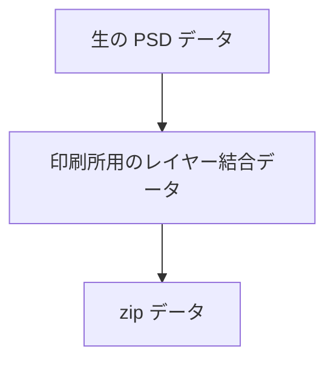
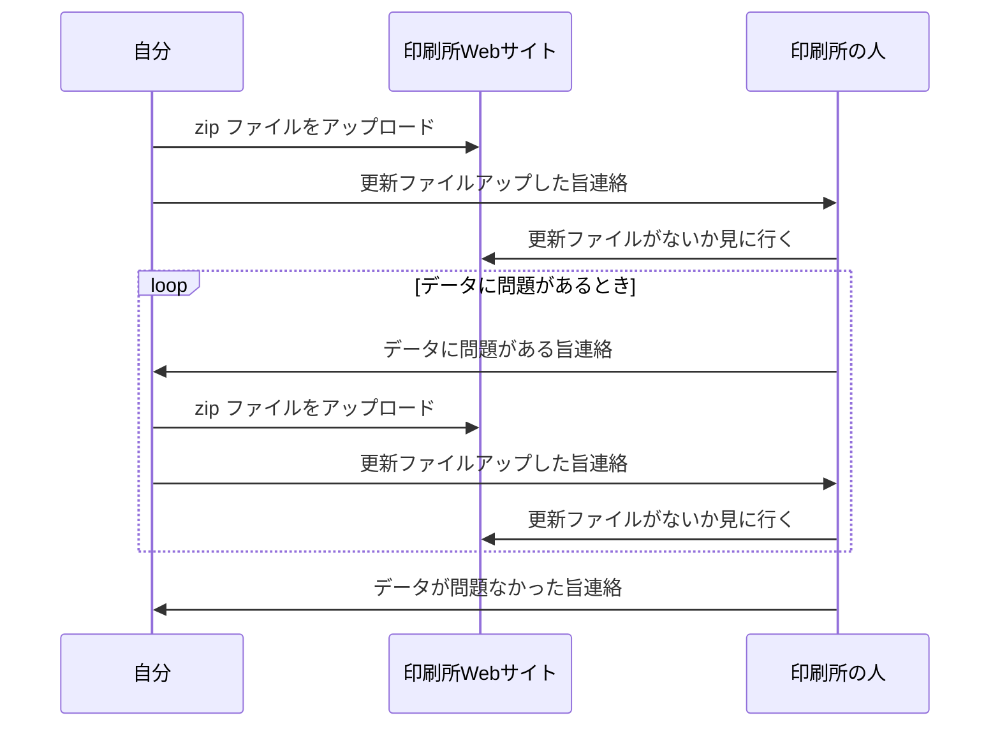

この記事は [mirko-san のアドベントカレンダー Advent Calendar 2022](https://adventar.org/calendars/8051) の 12月 10日の記事です。

## TL;DR

- 自分の絵を印刷所に刷ってもらうのってめちゃくちゃ面倒
- Deno の fs とか zip 使って印刷所に入稿するデータの製作を楽しました
- 趣味と趣味がクロスすると楽しい

## 経緯と印刷所まわりの小話

こんにちは。
私は普段はITエンジニアとして働きながら、趣味でお絵かきをしているオタクです。

さて、私はお絵かきをするので、この間自分の書いた絵を印刷所に入稿して印刷してもらうことにしたのですが、入稿作業ってすごく面倒なんですね。びっくりしました。

まず、絵のデータは基本的に以下のような順序で zip に固める必要があります。



さらに以下のようなやりとりでもって印刷所に届けられます。



まあすんなり行けばデータを一度アップして完了！ヨシ！となるのですが、データに問題がある場合は **再度生PSDデータを編集して zip に固める必要があるのです！！！！**

このサイクルをもう一度回さないとなりません。とてもつらい。


しかも入稿データには以下の制限があったりします。

- ファイル名に日本語などを使ってはいけない
  - 私の利用した印刷所や他の印刷所のマニュアルを見ても大抵かいてある
- でも印刷所の人とやり取りするため、ある程度分かりやすいファイル名じゃないといけない
  - 「`a.zip` の画像のキャラクターのあたりの色が `b.zip` の内容と違うんですけど大丈夫ですか？」みたいな連絡が来たりする
  - ランダム文字列とかにしてたらとても困るんじゃないかな

これをふまえて、もしデータ修正依頼がくると、手作業でやる場合以下のような作業が発生します。

- 元の PSD データを開いて修正
- 入稿用にすべてのレイヤーを結合
  - このとき、必要なレイヤーを非表示で結合したり、不要なレイヤーが表示されたまま結合していないか確認
- レイヤーを結合したファイルを zip に圧縮
- zip ファイルの名前を印刷所の人に伝わりやすいようにリネーム

発狂しそうになりますね。

このうち

- レイヤーを結合したファイルを zip に圧縮
- zip ファイルの名前を印刷所の人に伝わりやすいようにリネーム

は簡単にスクリプト化できそうだったので Deno でスクリプトにすることにしました。

## なんで Deno

- Deno が好きだから
- Windows 上で何も考えず動かしたかったから
  - Deno のバイナリポン置きで動くので
  - Web 上のアップローダーでファイルを選択しないといけない以上、 WSL 上にファイルを作るのは面倒そうだったので、 Windows 上にファイルを作りたかった

## 書いたもの

前提として、以下を参考に適当なところに deno のバイナリを置いておく必要があります。

https://github.com/denoland/deno_install#environment-variables

```typescript:src/mod.ts
import { compress } from "zip";
import { format } from "datetime";
import { exists } from "fs/exists.ts";
import { emptyDir } from 'fs/empty_dir.ts';

const date = format(new Date(), 'yyyy-MM-dd_hh-mm-ss');

if (!await exists("data/work_dir")) {
  throw new Error("Must exists 'work_dir'.");
}

if (!await exists("data/dist_dir")) {
  await emptyDir("data/dist_dir");
}

await compress("data/work_dir", `data/dist_dir/${date}.zip`);
```

```json:import_map.json
{
  "imports": {
    "zip": "https://deno.land/x/zip@v1.2.3/mod.ts",
    "date-fns": "https://deno.land/x/date_fns@v2.22.1/index.js",
    "datetime": "https://deno.land/std@0.165.0/datetime/mod.ts",
    "fs/": "https://deno.land/std@0.165.0/fs/"
  }
}
```

```json:deno.json
{
  "tasks": {
    "compress": "deno run -A src/mod.ts"
  },
  "importMap": "./import_map.json"
}
```

これで、 PowerShell からも `deno task compress` で `data/dist_dir` 以下に `yyyy-MM-dd_hh-mm-ss.zip` が生成されます。
基本的には `data/work_dir` 以下に印刷用ファイルを置いたら思考停止でコマンドを叩くだけで入稿用 zip ができるようになりました。ハッピー！

## さいごに

こんな感じで、入稿をすこし楽できるようにしました。
趣味と趣味がクロスすると楽しいです。プログラミングって、生活を豊かにしてくれて楽しいなって気持ちを新たにできました。
